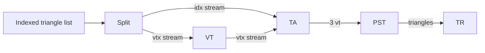

# README

## Graphics Pipeline

Stages:

- Split, it splits _index_ and _vertex buffer_;
- **VT** (Vertex Transform), it takes model space vertices and transform them into world space by multiplying them by world space matrix (rotate, scale, translate);
- **TA** (Triangle Assembler), it assbles 3 vertices into 1 triangle using index buffer;
  - Backface culling;
- **PST** (Post Process Triangle), perspective screen space transform;
- **TR** (Triangle Rasterizer);
